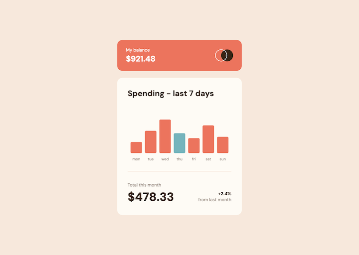
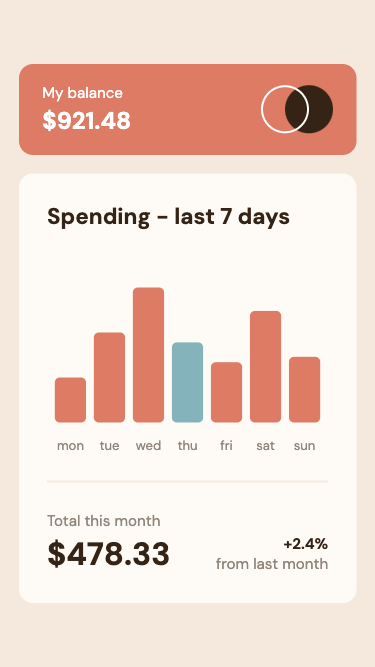

# Frontend Mentor - Expenses chart component solution

This is Max Ruuen's solution to the [Expenses chart component challenge on Frontend Mentor](https://www.frontendmentor.io/challenges/expenses-chart-component-e7yJBUdjwt).

## Table of contents

- [Overview](#overview)
  - [The challenge](#the-challenge)
  - [Screenshot](#screenshot)
  - [Links](#links)
- [My process](#my-process)
  - [Built with](#built-with)
  - [What I learned](#what-i-learned)
  - [Continued development](#continued-development)
  - [Useful resources](#useful-resources)
- [Author](#author)

## Overview

### The challenge

Users should be able to:

- View the bar chart and hover over the individual bars to see the correct amounts for each day
- See the current day’s bar highlighted in a different colour to the other bars
- View the optimal layout for the content depending on their device’s screen size
- See hover states for all interactive elements on the page

### Screenshot

#### Desktop Layout

#### Mobile Layout

### Links

- Solution URL: [Frontend Mentor](https://www.frontendmentor.io/solutions/expenses-chart-component-with-reactsvgd3js-HXGtUaS17C)
- Live Site URL: [Netlify](https://rd-challenge-expenses-chart.netlify.app/)

## My process

### Built with

- React
- D3.js
- SCSS
- Netlify Functions

### What I learned

This was a really cool challenge that gave me an opportunity to spend some quality time with D3.js, which I've been meaning to look at for a while. Before this project I had done some basic SVG manipulation with JS, but never really got too deep into it. After using D3.js I'm blown away by how seamless it feels when you start to get over the steep initial learning curve.

I'm also pretty proud of achieving responsive design with no media queries here - as someone who clung to media queries for all of life's device size problems while learning front-end, it's nice to finally be at a point where I'm using enough modern CSS to not require a single media query. Yay!

This challenge has definitely piqued my graph interest, as graphs/charts were also an area I had on my learning list. The accessibility of a graphs are a nightmare, I'm surprised there isn't a better way and I empathize hard with screen reader users opening a web page full of graphs... but I hope the graph here is accessible enough for keyboard navigation and screen reader users compared to examples I saw in the wild.

I approached this challenge in small stages:

- Manipulate SVG with JavaScript and no libraries to get familiar with the process.
  - Was able to parse input data & draw bar items which had Y axis scaling and dynamic X positioning as a really basic first test of how you'd do this with no JS library. This also helped with learning how to responsively resize the SVG and graph elements as container changes size.
- Manipulate SVG with D3.js.
  - Read through D3.js documentation, a few tutorials, and also reviewed examples of people building various graph types to understand how different D3 math & graph functions worked and how specific chart elements were added (axis labels, tooltips, reliable scaling etc).
- Implement D3.js graph in React with `useState`/`useRef`/`useLayoutEffect`
  - At this point I felt comfortable enough that I understood what D3.js was doing to work this into React. I did lots of research on other implementations to confirm if my "`useState`/`useRef`/`useEffect`" stategy was any good, and was pretty surprised when I wasn't far off the mark.
  - Kind of surprised that there arent many actively maintained libraries for using React/D3.js together at present. This strategy with hooks starts to feel a bit... large? I'd imagine some of the more complicated graphs would become a nightmare, but given how scary most vanilla D3.js implementations start to look, maybe this is just the accepted norm.
  - `useLayoutEffect` over `useEffect` for this case was an improvement identified in a few docs. We're mutating the DOM directly during effect with D3.js/`useRef`, so we want our mutations in the effect to be executed **after** React's DOM mutations are done, but before the browser repaints and shows React's changes to the user.

### Continued development

Eventually I want to adjust the endpoint that returns graph data to return randomly generated data, and have a button on the page to trigger this data refresh. I'd like to animate the bars and text when data changes.

### Useful resources

#### D3.js

- [D3.js Documentation](https://d3js.org/getting-started)
- [D3 Graph Gallery - Responsive chart resizing](https://d3-graph-gallery.com/graph/custom_responsive.html)
- [Freecodecamp - D3.js for Beginners](https://www.freecodecamp.org/news/d3js-tutorial-data-visualization-for-beginners/)

#### Making React play nice with D3.js

- [InfluxData - D3.js and React](https://www.influxdata.com/blog/guide-d3js-react/)
- [Nick Coughlin - D3.js and React](https://ncoughlin.com/posts/d3-react/)
- [Kent C Dodds - useEffect vs useLayoutEffect](https://kentcdodds.com/blog/useeffect-vs-uselayouteffect)

#### SVG accessibility

- [W3C - Graphics Module Roles spec](https://www.w3.org/TR/graphics-aria-1.0/) - This provides a good explainer and some examples of the `graphics-symbol` ARIA role I've used for the bar graph `<rect>` elements, alongside the `aria-roledescription` and `aria-label` strategy for having these read out by screen readers correctly.

## Author

- Frontend Mentor - [@ruuendigital](https://www.frontendmentor.io/profile/ruuendigital)
- Twitter - [@maxruuen](https://www.twitter.com/maxruuen)
